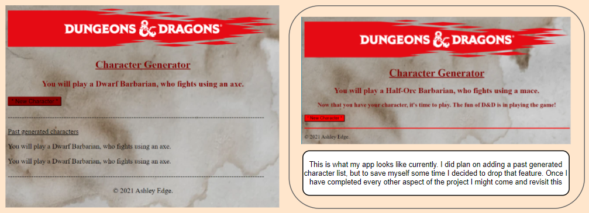

# Simple Character Generator

This repo forms my DevOps Core Practical Project Specification individual project. At its core, I will be creating an application that generates a random race, class and weapon to help you start your journey in Dungeons & Dragons. I am required to create a service-orientated architecture for my application, this application must be composed of at least 4 services that work together.

The requirements set for the project are below:

- A Kanban board
- The project must follow the Service-oriented architecture of at least 4 services that work together
- An Application fully integrated into GitHub, built through Jenkins and deployed to a GCP virtual machine
- The project must make use of NGINX (reverse proxy) to make your application accessible to the user
- The project must be deployed using Docker and Docker Swarm
- Create an Ansible Playbook that will provide the environment that your application needs to run
- Use Webhooks so that Jenkins recreates and redeploys the changed application from GitHub

I will be considering the concept of MVP (Minimum Viable Product) as I plan this project, completing all the requirements before adding any extra functionality that isn't specified above.

## Contents
* [Planning ](#Planning)
* [Risk assessment](#Risk-assessment)
* [Architecture ](#Architecture)
* [MySQL Database](#MySQL-Database)
* [Service1](#Service1)
* [Service2 and service3](#Service2-and-service3)
* [Service4](#Service4)
* [Different Implementations](#Different-Implementations)
* [Docker](#Docker)
* [Ansible](#Ansible)
* [CI Pipeline](#CI-Pipeline)
* [Jenkins](#Jenkins)
* [Acknowledgements](#Acknowledgements)

## Planning
I used a Trello board to plan and keep on top of my tasks. I used simple to-do, doing and done lists. I can set myself tasks in the to-do list, remember what I am working on in the doing list (so I can juggle a few tasks at once) and once I have finished a task I will drag it into the done list. [Only works for admin](https://trello.com/invite/b/yaZs4MWM/ATTI5cf161be6cfebec7d8bda8926ea5bd04C7368792/dd-character-generator)

My initial Trello board layout to get me started. More tasks will be added to the to-do list as required


## Risk assessment

Below you will find my risk assessment for this project. Two things from the table occurred to me. Towards the last stage of the project (Jenkins), while I was debugging to make sure my app was built and deployed through Jenkins, my DnD-manager VM became unviable. I somehow managed to lose side privileges and was unable to install/alter any documents. This also meant that Jenkins would no longer attempt to build my app at all. I had to spin up a fresh VM and re-configure everything. As a result, I was unable to finish the project on time. Luckily I had before this occurred I had pushed my code to this GitHub repo. I have spent some time after the handing deadline to complete this project as I absolutely loved working on this.


## Architecture

I am are required to create a service-orientated architecture for my application, this application must be composed of at least 4 services that work together. Service 1 will be my app's core service. Service 1 will render my Jinja2/HTML templates I need to interact with my application, it will also be responsible for communicating with the other 3 services, and finally for persisting my character data in an SQL database. Service 2 and 3 will both create a random Race and Class respectively for the D&D character, grabbed from the official D&D Player's Handbook. Service 4 will create a weapon for your character to fight with, this weapon will be based upon the results from service 2 and 3 using some pre-defined rules. For the purpose of this project, I will be keeping my application simple in order to hit the MVP in time for the deadline. For services 2, 3 and 4 I am required to create 2 different implementations, I must be able to demonstrate swapping these implementations out for each other seamlessly, without disrupting my user's experience. I will talk about this later on in this README.md file.

My service-orientated architecture plan


After working through the project my plan has evolved


## MySQL Database

I will be using MySQL to house and generate my D&D characters. Service 1 will determine the characters race, service 3 will determine the characters class and service 4 will combine the results from service 2 and 3 and generate a weapon. In the image below you can see that MySQL has been successfully created. I populated the table with my dummy character with the following code;
```
Character1=Character(character_race="a Dwarf", character_class="Fighter", weapon="whips")
db.session.add(Character1)
db.session.commit()
```


## Service1

Service 1 basically performs a **GET** request on services 2 and 3, and a **POST** request on service 4. It talks with the other services(2, 3 & 4) to gain the data needed from a MySQL database. Service 1 then uses that information to display it to the user through my HTML/Jinja2 index.html file. Below is plan and result of my app.  The current generated character will be presented followed by a new character button that will essentially refresh the page.


### Service1 testing

I will be testing this service by mocking up a response that I think service 2, 3 and 4 would give me.
```
class TestResponse(TestBase):
    def test_character(self):
        with requests_mock.mock() as m:
            m.get("http://localhost:5001/race", text='a Dwarf')
            m.get("http://localhost:5002/class", text='Barbarian')
            m.post("http://localhost:5003/weapon", text='a battle axe')
            response = self.client.get(url_for('index'))
            self.assertIn(b'a battle axe', response.data)
    def test_character(self):
        with patch("requests.get") as g:
            with patch("requests.post") as r:
                g.return_value.text = "an Elf"
                r.return_value.text = "whips"
                response = self.client.get(url_for("index"))
                self.assertIn(b"You will play an Elf an Elf, who fights using whips", response.data)
```


## Service2 and service3

Service2 and service3 will act very similar. Once I have coded and checked that service2 works, I will replicate the code and edit it to select a random class for servive3.

Service2 will generate a random race for our character.
```
@app.route('/race', methods=['GET'])
def character_race():
    character_races = ["a Dwarf", "an Elf", "a Halfling", "a Human"]
    character_race = random.choices(character_races)
    return Response(str(character_race[0]), mimetype="text/plain")
```

Success! :smile: I can move onto coding service3


Service3 will generate a random class for our character.
```
@app.route('/class', methods=['GET'])
def character_class():

    character_classes = ["Barbarian","Cleric", "Fighter", "Paladin", "Wizard"]
    character_class = random.choices(character_classes)
    return Response(str(character_class[0]), mimetype="text/plain")
```

Now service 3 is working too.


Both results will then be used by service4

### Service2 and service3 testing

These tests are very simple. I am simply testing that service2 does in fact return a random race, and service3 does return a random class.

service2 test
``` 
class TestCreate(TestBase):
    def test_character_race(self):
        response=self.client.get(url_for('character_race'))
        self.assertEqual(response.status_code,200)
        self.assertIn(response.data, [b'a Dwarf', b'an Elf', b'a Halfling', b'a Human'])
```

service3 test
```        
class TestCreate(TestBase):
    def test_character_class(self):
        response=self.client.get(url_for('character_class'))
        self.assertEqual(response.status_code,200)
        self.assertIn(response.data, [b"Barbarian",b"Cleric", b"Fighter", b"Wizard"])
```


## Service4

Service 4 will create a weapon for your character to fight with, this weapon will be based upon the results from service 2 and 3 using some pre-defined rules. Below you will find an example of how a weapon is decided for the Dwarf race. This code will be repeated for each race. With service4 all done my app now works and looks like the right-hand image shown in the [Service1](#Service1) section.

### Service4 testing

Service 4 is another simple test, just to check that if "a Dwarf" race and "Barbarian" class is selected, that "a battle axe" weapon is selected as desired.

```
class TestResponse(TestBase):
    def test_weapon(self):
        response = self.client.post(url_for('weapon'), json={"character_race":"a Dwarf", "character_class":"Barbarian"})
        self.assertEqual(b"a battle axe", response.data)
```


## Different Implementations

For services 2, 3 and 4 I am required to create 2 different implementations of my app. I must be able to demonstrate swapping these implementations out for each other seamlessly, without disrupting the user experience. For this, I have decided to treat my implementation as an app update, where new character classes and races have been added. To make it really clear to the user I will be altering the HTML with a "Now with new races and classes!" notice. :smile: I will also add the past characters feature I mentioned in my [Service1](#Service1) I altered all tests too.

Now with new races and classes!


## Docker

I will use Docker compose to create and link my docker containers. First, I want to manually containerise my 4 services and my MySQL database within the same network (DnD-network) to make sure everything is working properly before I move on to writing my docker-compose.yaml file. This will give me the chance to familiarise myself with the concept, edit my code accordingly and write a compatible Dockerfile that does as I want. Within the service1 container, I have to run the create.py file to finalise the connection. Now when I visit [VM's IP address]:5000 the app is working as it did before :smile: Wrote a Docker-compose.yaml file based on what I learnt from manually creating my container.


## Ansible

I will be using Ansible to configure my vm docker swarm. My swarm will be made up of a DnD-nginx, DnD-manager and DnD-worker GCP VM's. The user will access the app through DnD-nginx's IP on port 80 to protect the IP addresses of my actual ap.


After a few trial and errors, I finally got ansible to configure my 3 VM that will become my swarm as planned above. 

```
sudo ansible-playbook -i inventory.yaml playbook.yaml
```

I did initially have a docker problem. Uninstalling and re-installing docker seemed to have fixed the problem :smile:


## CI Pipeline

Below you can see my continuous integration (CI) pipeline. It depicts how everything in this project works and connects together. Jenkins allows for continuous and automatic integration of any new code(new implementations).


## Jenkins

Now that I have everything working separetly, It's time to move onto Jenkins.

## Acknowledgements

I would like to thank all my trainers (Ben Hesketh, Jay Grindrod, Nathan Forester, Peter Rhodes and Raji Kolluru) for their teaching, continuous help and support. I would also like to thank my classmates for their help, support and motivation, as well as the community of stack overflow. I would also like to state that I in no way own the Races, Classes and Weapons mentioned in this application. All information (Logo's included) belong to Dungeons & Dragons and sourced from their "Player's Handbook" 5th edition. If you have stumbled upon this app, liked it and wish to use it yourself, feel free. If you have any notes for improvements I would love to hear from you.
